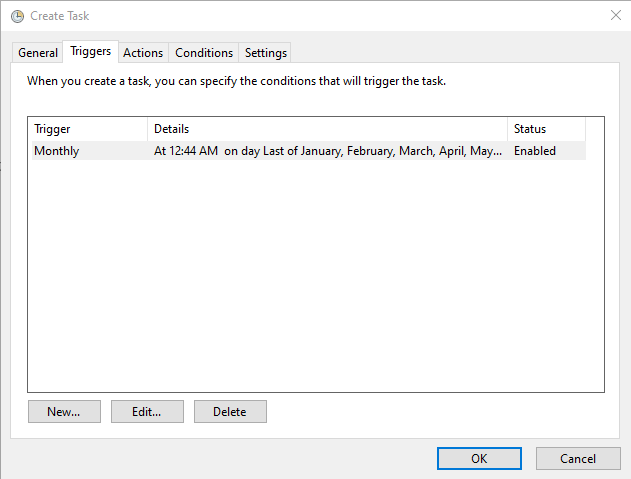
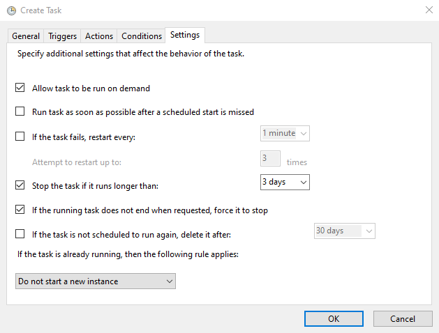

# StuffSorter
Yet another PowerShell script

## Introduction
Got a cluttery Downloads folder with different files all over the place?
Having a hard time finding your files?
With this small script you can have a squeaky clean folder with categorized files almost instantly.

## Features
 o	Sort files by filetype from a location to a given destination into the corresponding folders ordered by type
    o	Example: There's a folder with photos, music and videos. The script will create a folder for each type (photo, music, video) and copy the corresponding files there
 o	Script will write a log with each file moved where the user can choose a custom source path and a custom destination
 o	Script will count, how many files have been moved
 
 ## Automate it!
 You could easily automate the process so you dont ever have to worry about a cluttery folder again.
 It's very easy and for this purpose we use Windows Task Scheduler:
 
 1. Open the Task Scheduler by searching for it with Windows Search
 2. Create a new task on the right side pane of the window
 3. Now follow the screenshots to setup: 
 4. 
 5. 
 6. 
 7. 
 8. 
